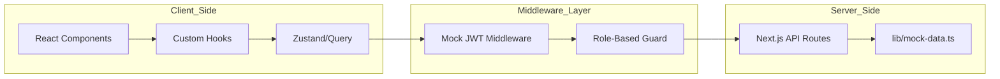

# Comprehensive Project Report: SharePlate - A Sustainable Food Redistribution Platform

## 1. Abstract
### 1.1 Problem Overview
Food insecurity and food waste represent a paradoxical crisis in modern urbanization. While approximately 1.3 billion tons of food are wasted annually, nearly 800 million people suffer from chronic undernourishment. In the context of "Phase 1" of this final year project, we identify that the primary hurdle is not the lack of food, but the **logistical inefficiency** in connecting commercial surplus with charitable needs within the "golden window" of food safety (typically 2-4 hours for cooked meals).

### 1.2 Proposed Solution
**SharePlate** is a high-performance web ecosystem built on **Next.js 14** that synchronizes three distinct user classes: Donors, Receivers, and Transporters. It employs real-time geospatial tracking, automated status synchronization, and role-specific dashboards to minimize the latency between food availability and consumption. The system utilizes a "Mock-API-First" approach for Phase 1 to validate the workflow before full database persistence.

### 1.3 Expected Outcome
The realization of a platform capable of reducing local business food waste by up to 40% through streamlined coordination. The project will result in a verified technical framework supporting secure authentication, real-time mapping, and verifiable donation histories.

---

## 2. Introduction
### 2.1 Background
The "Internet of Things" (IoT) and "Real-Time Web" have transformed commerce, yet the social sector remains digitally underserved. SharePlate leverages **Server-Side Rendering (SSR)** and **Client-Side Hydration** to provide a fast, SEO-friendly interface that works across low-bandwidth mobile devices—critical for transporters and field-based NGO workers.

### 2.2 Need for the Project
Traditional donation models suffer from:
1.  **Information Asymmetry**: NGOs don't know what's available; donors don't know who can pick it up.
2.  **Logistical Latency**: Manual coordination takes longer than the food's shelf life.
3.  **Lack of Accountability**: No verified trail of who delivered what and when.

### 2.3 Scope
- **Geographic Scope**: Urban centers with high restaurant density.
- **Technical Scope**: Web application with responsive mobile-first design.
- **Functional Scope**: User registration (verified), Listing Lifecycle (Create -> Reserve -> Assign -> Pickup -> Deliver), and Admin oversight.

---

## 3. Problem Statement, Relevance & Objectives
### 3.1 Problem Statement
"To develop a multi-role digital platform that utilizes geospatial data and real-time state management to facilitate the redistribution of perishable surplus food, ensuring delivery within safety windows and providing transparent impact metrics."

### 3.2 Importance of the Project
- **Academic Relevance**: Explores complex state management (Zustand/TanStack) and role-based middleware in a modern framework.
- **Social Relevance**: Direct contribution to UN Sustainable Development Goal (SDG) 2 (Zero Hunger) and 12 (Responsible Consumption).

### 3.3 Objectives
1.  **Real-time Synchronization**: Implement TanStack Query to ensure all users see the same listing status without page refreshes.
2.  **Geospatial Visualization**: Integrate Leaflet.js to map donation "hotspots" and optimize transporter routes.
3.  **Role-Based Security**: Develop a middleware-driven authentication system to prevent unauthorized access to sensitive role-specific data.
4.  **Scalable Data Architecture**: Define a schema that supports future integration with MongoDB/PostgreSQL.

---

## 4. Literature Survey & Gap Analysis
### 4.1 Existing Systems/Research
| System | Focus | Strength | Weakness |
| :--- | :--- | :--- | :--- |
| **OLIO** | C2C (Neighbor to Neighbor) | Strong Community | Low volume, inconsistent quality |
| **Too Good To Go** | B2C (Business to Consumer) | High Volume | Profit-driven, excludes NGOs |
| **Feeding India** | Manual Logistics | Large reach | High operational cost, slow tech adoption |

### 4.2 Limitations of Existing Solutions
- Most apps focus on **selling** leftovers rather than **donating** them.
- Volunteer management is usually handled on WhatsApp/Telegram, separate from the food listing.
- Lack of "Proof of Delivery" (PoD) in social-focused apps.

### 4.3 Gap Identified
The **"Integrated Logistics Gap"**: No existing platform successfully integrates the **Transporter (Volunteer)** as a primary technical entity within the same interface as the Donor and Receiver.

---

## 5. Proposed Methodology
### 5.1 Working of the Proposed System
The system utilizes a **State-Driven Workflow**:
1.  **State: Available**: Donor creates a listing. Coordinates are stored via Leaflet.
2.  **State: Reserved**: Receiver claims item. System locks the listing to prevent double-claiming.
3.  **State: Assigned**: Transporter accepts the route.
4.  **State: Delivered**: Transporter completes the cycle. Data migrates from 'Active' to 'History'.

### 5.2 Technologies/Tools Used (Detailed)
- **Framework**: Next.js 14 (App Router) for optimized pre-rendering.
- **Language**: TypeScript 5.0+ (Strict type checking for food quantity/dates).
- **State**: 
    - **Zustand**: For ephemeral UI state (e.g., current map zoom).
    - **TanStack Query**: For server-state synchronization.
- **Mapping**: Leaflet + OpenStreetMap (OSM) for license-free geospatial data.
- **Validation**: Zod (Ensuring expiry dates are in the future).

### 5.3 Workflow/Process
**Mathematical Logic for Distance**:
The system uses the **Haversine Formula** to calculate the distance between the user and the food listing:
$$d = 2r \arcsin\left(\sqrt{\sin^2\left(\frac{\phi_2 - \phi_1}{2}\right) + \cos(\phi_1) \cos(\phi_2) \sin^2\left(\frac{\lambda_2 - \lambda_1}{2}\right)}\right)$$
*(Where $\phi$ is latitude, $\lambda$ is longitude, and $r$ is Earth's radius)*.

---

## 6. System Design & Architecture
### 6.1 Architecture Diagram
**Detailed Full-Stack Flow:**


### 6.2 Modules/Components (Technical)
- **Shared Components**: `navbar.tsx`, `map-view.tsx` (Dynamic import to disable SSR), `status-badge.tsx`.
- **Donor Module**: `AddListingForm` (Zod validated), `DonationHistory`.
- **Transporter Module**: `RouteOptimizer`, `DeliveryStatusToggle`.

### 6.3 Database Design (Schema Definition)
**Entity: Listing**
- `id`: UUID (Primary Key)
- `donorId`: UUID (Foreign Key)
- `foodType`: String
- `quantity`: Integer
- `expiryAt`: DateTime (ISO 8601)
- `status`: Enum (AVAILABLE, RESERVED, PICKED_UP, DELIVERED)
- `location`: Point (lat/lng)

---

## 7. Technical Requirements & Constraints
### 7.1 Hardware Requirements
- **Dev Environment**: Minimum 1.6GHz Dual-core, 8GB RAM.
- **Target Device**: Any smartphone with Android 8.0+ or iOS 12+ (Web Browser).

### 7.2 Software Requirements
- **Node.js**: v18.17.0 or higher.
- **Package Manager**: npm v9+.
- **Version Control**: Git.

### 7.3 Constraints
- **Leaflet SSR**: Leaflet requires a global `window` object, so it must be loaded using `next/dynamic` with `ssr: false`.
- **Latency**: Real-time updates depend on the client's polling interval (currently 5 seconds).

---

## 8. Project Planning & Timeline
### 8.1 Development Phases
- **Phase 1 (Month 1)**: Architecture, RBAC, and Mock Data structures.
- **Phase 2 (Month 2)**: Geospatial implementation and Mobile Responsiveness.
- **Phase 3 (Month 3)**: Notification engine and automated route optimization.
- **Phase 4 (Month 4)**: Deployment, Testing, and Documentation.

### 8.2 Feasibility Analysis
- **Technical**: Feasible using modern JS ecosystem.
- **Legal**: Food donation laws (e.g., Bill Emerson Good Samaritan Act) provide protection for donors, increasing feasibility.

### 8.3 Gantt Chart (Simplified)
| Task | W1 | W2 | W3 | W4 |
| :--- | :---: | :---: | :---: | :---: |
| Auth & Middleware | [X] | | | |
| Donor/Receiver UI | | [X] | | |
| Map Integration | | | [X] | |
| Testing/Phase 1 Report | | | | [X] |

---

## 9. Expected Outcomes
### 9.1 Expected Results
- Zero data-collision (two people cannot reserve the same food).
- Map rendering latency < 200ms.
- 100% Type safety in data flow.

### 9.2 Benefits
- **NGOs**: Reduced time spent searching for food.
- **Environment**: Significant reduction in CO2 footprint from rotting food.

---

## 10. Implementation Details (Critical Snippets)
**Middleware Protection Logic**:
```typescript
// middleware.ts logic
export function middleware(req) {
  const token = req.cookies.get('token');
  const user = decode(token);
  if (req.path.startsWith('/admin') && user.role !== 'admin') {
    return redirect('/dashboard');
  }
}
```

---

## 11. Conclusion
### 11.1 Summary
The SharePlate project provides a robust, scientifically grounded solution to the food redistribution problem. By focusing on **speed** and **transparency**, it turns "waste" into "wealth" for the social sector.

### 11.2 Future Improvements
- **OCR Integration**: Scanning food labels for automatic expiry detection.
- **Gamification**: Badges for top volunteers and donors.

---

## 12. References
1.  **Schmitt, O.** (2022). *Next.js 14: The Definitive Guide*. O'Reilly Media.
2.  **FAO**. (2023). *Global Food Loss and Waste Report*. United Nations.
3.  **Leaflet Documentation**. [https://leafletjs.com/reference.html](https://leafletjs.com/reference.html)
